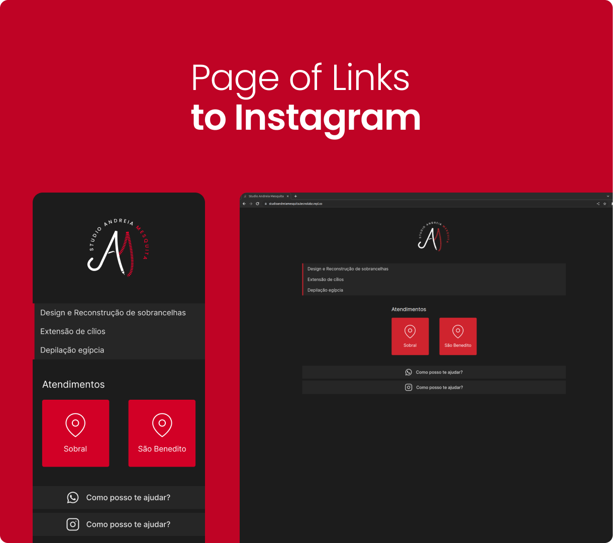

# Studio Andreia Mesquita 📱

This is a local freelance project that I developed on a voluntary basis. The project is a page of links that directs the user to the client's networks and informs the location of available services.

  

<h2>Techs</h2>

It was used to build this application:

- Figma
- HTML/CSS

<h2>License</h2>

Licensed under the <a href="./LICENSE">MIT</a> license.
